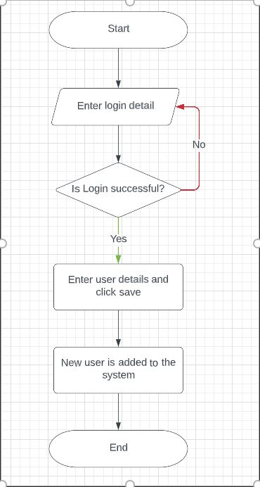
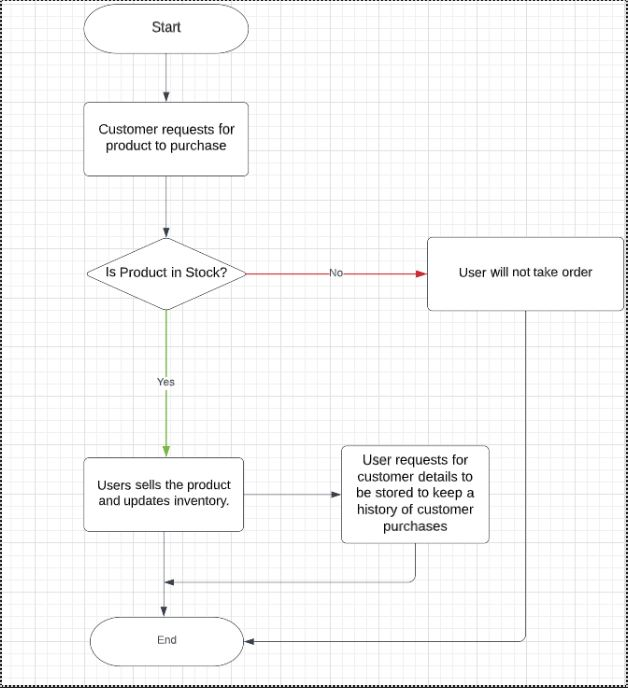

# Inventory-management-system
This is an application developed using Java, Swing and MySQL which provides as easy way to track products, customers and users for a physical retail store.
There are two users, Admin and store users. Both the users can manage products, customers.
The only difference between users and administrator is administrator can create, view and manage other users.

Purpose and Scope:

The purpose of this project is to create an application for inventory management for a retail store. The scope of this project includes management of users/store employees, products and customer details. Admin manages users. User handles product and customer details. Admin and users are responsible for the inventory management. User issues products to the customers based on the orders placed. This project assumes inventory has products stored that have been purchased from the suppliers. 

Project details:

The admin will be able to login to the system and add new users. Once in the system, the admin/user will have the following options: 

1)Add new products 

2)Update product details 

3)Delete products from the system 

4)Customer requests for a product. If product is available, then it is issued immediately and inventory is updated. Otherwise order is not taken. 

5)Add customer details who have bought the products 

6)Update customer details 

The following diagrams depict the logic specifications of the inventory management system:

1)User details flow:

2)Customer-store interaction:

Installation steps:

1)Import the code to Eclipse IDE.

2)For creating database, import the databaseschema.sql file in MySQL workbench. Also download jdbc jar file.

MySQL workbench download link:
https://dev.mysql.com/downloads/workbench/

JDBC Jar for MySQL:
https://dev.mysql.com/downloads/connector/j/

3)Run the code to launch the application

4)Credentials:
To login to Inventory Management System application use the below credentials. 
Admin:
   - Username: `sushma`
   - Password: `pass123`

   User:
   - Username: `gretta`
   - Password: `pass123`

   Also, make sure MySQL is:
   - Username: `root`
   - Password: `admin`

 
